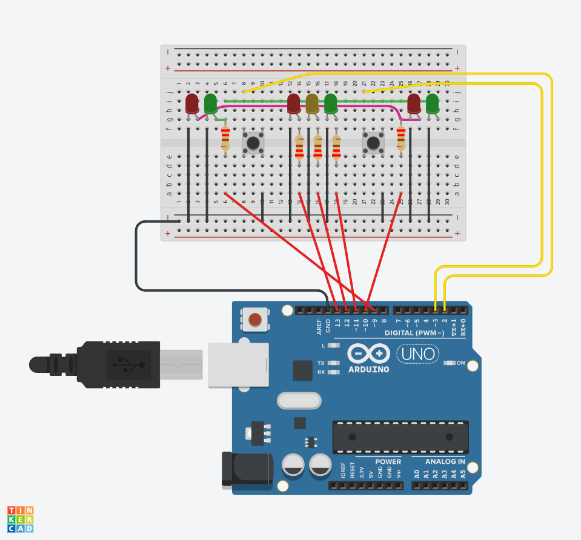
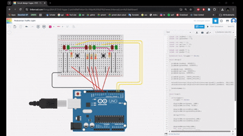

# Pedestrian Traffic Light
## Overview
Sistem lampu lalu lintas merupakan komponen penting dalam pengaturan arus kendaraan dan keselamatan pejalan kaki. Salah satu implementasi sederhana adalah sistem pedestrian traffic light, yang memungkinkan pejalan kaki untuk menyeberang jalan dengan aman melalui mekanisme kontrol berbasis tombol.
## Komponen
Komponen  yang digunakan dalam mini proyek ini diantaranya:
* Arduino
* Breadboard
* 7 buah LED (3 Merah, 1 Kuning, 3 Hijau)
* 5 resistor 220Ω
* Kabel jumper
* 2 buah push button
## Skema

## Alur Sistem
Alur kerja sistem pedestrian traffic light ini dirancang agar kendaraan dan pejalan kaki dapat bergantian menggunakan jalan secara aman. Sistem bekerja dengan bantuan push button sebagai input dari pejalan kaki. Berikut tahapan prosesnya:
1. Kondisi awal sistem memulai dengan kondisi:
* Lampu kendaraan hijau menyala
* Lampu pejalan kaki merah menyala
  Pada kondisi ini, kendaraan dapat berjalan seperti biasa dan pejalan kaki belum diperbolehkan menyeberang.
2. Sistem akan melakukan pembacaan pada push button.
  * Jika belum ada tombol yang ditekan, kondisi lampu tidak berubah (tetap pada kondisi awal).
3. Ketika salah satu push button ditekan oleh pejalan kaki:
* Sistem mendeteksi adanya permintaan untuk menyeberang
* Proses perubahan lampu mulai dijalankan
4. Lampu kendaraan berubah dari Hijau → Merah, memberi tanda kendaraan harus berhenti.
5. Lampu pejalan kaki sebelah kanan maupun kiri berubah menjadi hijau, menandakan pejalan kaki sudah diperbolehkan menyeberang.
6. Kedua lampu pejalan kaki tetap hijau selama 5 detik (5000ms).
  * Selama fase ini, kendaraan tetap berhenti.
7. Setelah 5 detik,
  * lampu pejalan kaki, baik kanan maupun kiri, berubah kembali menjadi merah.
  * lampu kendaraan akan berkedip 3 kali, masing masing kedipan berdurasi 1 detik
  * setelah 3 kali berkedip, lampu kendaraan akan kembali hijau
8. Sistem kembali ke mode awal dan siap menerima input berikutnya. 

## Simulasi
Simulasi dilakukan menggunakan platform Tinkercad seperti video berikut:

